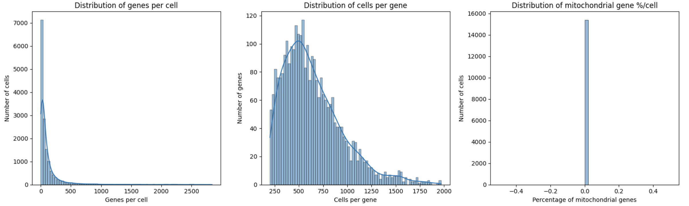
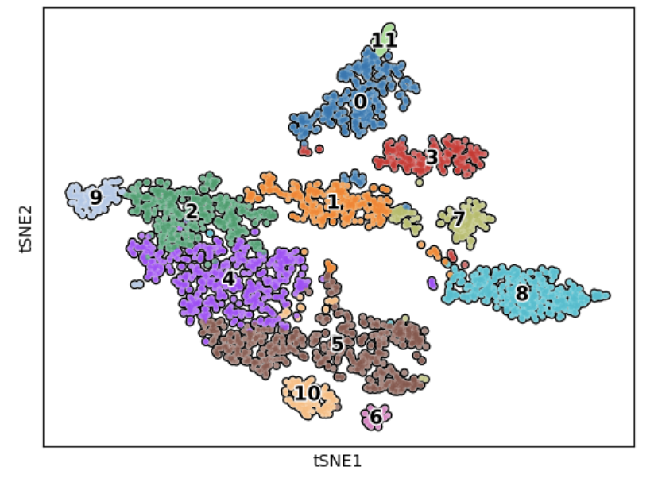
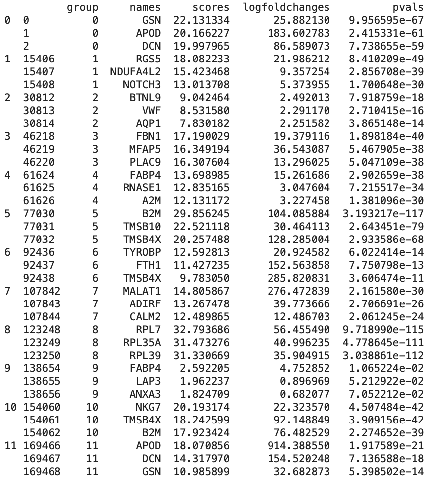
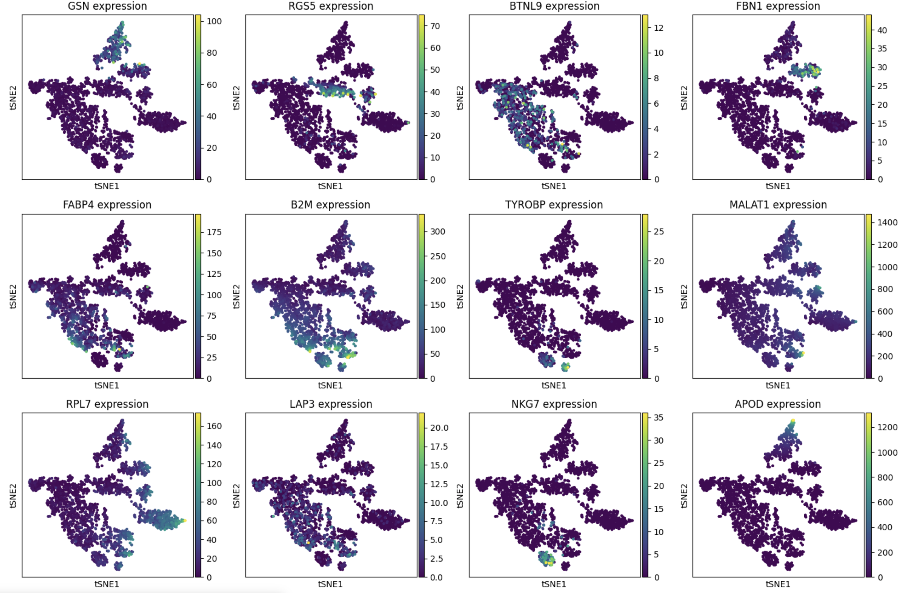

# 🧬 Project Introduction 

Skeletal muscle is a diverse and complex tissue made up of various muscle fibers and other cell types. Besides its well-known role in movement, muscle tissue also affects other important processes like immunity, metabolism, and brain function. To fully understand these effects, we need to look closely at the different types of cells in skeletal muscle, which is made possible with single-cell RNA sequencing. 

In this project repo, we’ll explore the gene expression patterns in human skeletal muscle cells by analyzing single-cell RNA sequencing data from the vastus lateralis muscle of four different people. Our goal is to figure out what kinds of cells are present in the muscle and identify them using both well-known and new marker genes.

The data for this project comes from a study called "Single-cell transcriptional profiles in human skeletal muscle" (GEO accession number [GSE130646](https://www.ncbi.nlm.nih.gov/geo/query/acc.cgi). For each of the four subjects, the single-cell RNA sequencing data can be accessed using the following GEO accession numbers: [GSM3746212](https://www.ncbi.nlm.nih.gov/geo/query/acc.cgi?acc=GSM3746212), [GSM3746213](https://www.ncbi.nlm.nih.gov/geo/query/acc.cgi?acc=GSM3746213), [GSM3746214](https://www.ncbi.nlm.nih.gov/geo/query/acc.cgi?acc=GSM3746214), and [GSM3746215](https://www.ncbi.nlm.nih.gov/geo/query/acc.cgi?acc=GSM3746215).

# 🧬 Project Walkthrough 
### Import Libraries 
Before starting this project you'll need to import the following libraries in Python:
```
import pandas as pd
import scanpy as sc
import numpy as np
import anndata as an
import matplotlib.pyplot as plt
import seaborn as sns
import scanorama
```
### Get Data, Decompress Files, and Create AnnData Object
First, we need to use Bash's ```wget``` command to retrieve the sc-RNA-Seq data associated with each subejcts muscle sample, then we'll use the ```gunzip``` command to decompress the files:
```
!wget -O GSM3746212_Muscle_1_Counts.csv.gz 'https://www.ncbi.nlm.nih.gov/geo/download/?acc=GSM3746212&format=file&file=GSM3746212%5FMuscle%5F1%5FCounts%2Ecsv%2Egz'
!gunzip GSM3746212_Muscle_1_Counts.csv.gz

!wget -O GSM3746213_Muscle_2_Counts.csv.gz 'https://www.ncbi.nlm.nih.gov/geo/download/?acc=GSM3746213&format=file&file=GSM3746213%5FMuscle%5F2%5FCounts%2Ecsv%2Egz'
!gunzip GSM3746213_Muscle_2_Counts.csv.gz

!wget -O GSM3746214_Muscle_3_Counts.csv.gz 'https://www.ncbi.nlm.nih.gov/geo/download/?acc=GSM3746214&format=file&file=GSM3746214%5FMuscle%5F3%5FCounts%2Ecsv%2Egz'
!gunzip GSM3746214_Muscle_3_Counts.csv.gz

!wget -O GSM3746215_Muscle_4_Counts.csv.gz 'https://www.ncbi.nlm.nih.gov/geo/download/?acc=GSM3746215&format=file&file=GSM3746215%5FMuscle%5F4%5FCounts%2Ecsv%2Egz'
!gunzip GSM3746215_Muscle_4_Counts.csv.gz
```
Following that, we'll read the decompressed muscle counts csv files with Panda's ```read_csv()``` function, then we'll convert the individual CSV files into Anndata objects before combining them into a single AnnData object:
```
file_1 = pd.read_csv('GSM3746212_Muscle_1_Counts.csv', index_col=0)  
muscle_1 = sc.AnnData(file_1)

file_2 = pd.read_csv('GSM3746213_Muscle_2_Counts.csv', index_col=0)  
muscle_2 = sc.AnnData(file_2)

file_3 = pd.read_csv('GSM3746214_Muscle_3_Counts.csv', index_col=0) 
muscle_3 = sc.AnnData(file_3)

file_4 = pd.read_csv('GSM3746215_Muscle_4_Counts.csv', index_col=0)  
muscle_4 = sc.AnnData(file_4)

# store all hour anndata objects in a list, then combine all 4 anndata objects into a single anndata object 
adatas = [muscle_1, muscle_2, muscle_3, muscle_4]
adata_combined = sc.concat(adatas, axis=1, label='sample', keys=['muscle_1', 'muscle_2', 'muscle_3', 'muscle_4'])
adata_combined.var_names_make_unique()
```
Next, we'll transpose our AnnData object so the rows are cell ID's and the columns are genes (since this is assumed for many down stream analysis):
```
adata_transposed = sc.AnnData(adata_combined.T)
```
Then, we'll print some basic summary information for our AnnData object:
```
# print summary info
num_genes = adata_combined.n_obs
print(f"Number of genes: {num_genes}")
num_cells = adata_combined.n_vars
print(f"Number of cells: {num_cells}")
```
Following the code block above we'll see the following output:
- Number of genes: 15406
- Number of cells: 2876

### Quality Control, Filtering, and Normalization 

To start, we'll check if there's any missing data in our combined AnnData object:
```
# find indices of rows (cells) with NaN values
nan_rows = np.isnan(adata_combined.X).any(axis=1)
print(f"Number of rows with NaN values: {np.sum(nan_rows)}")

# find indices of columns (genes) with NaN values
nan_cols = np.isnan(adata_combined.X).any(axis=0)
print(f"Number of columns with NaN values: {np.sum(nan_cols)}")
```
Which produces the following output:
- Number of rows with NaN values: 0
- Number of columns with NaN values: 0

Luckily, there are no missing values. Next, we'll look at the distribution of genes per cell, cells per gene, and percent mitochondrial content per cell to determine our filtering criteria:
```
# calculate the number of genes per cell and cells per gene
adata_combined.obs['n_genes'] = (adata_combined.X > 0).sum(axis=1)
adata_combined.var['n_cells'] = (adata_combined.X > 0).sum(axis=0)

# identify mito genes and calculate % of mitogenes per each cell
mt_gene_mask = adata_combined.var_names.str.startswith('MT-')

if isinstance(adata_combined.X, np.ndarray):  
    adata_combined.obs['percent_mito'] = np.sum(adata_combined[:, mt_gene_mask].X, axis=1) / np.sum(adata_combined.X, axis=1) * 100
else:  
    adata_combined.obs['percent_mito'] = np.sum(adata_combined[:, mt_gene_mask].X.toarray(), axis=1) / np.sum(adata_combined.X.toarray(), axis=1) * 100

# create subplots
fig, axes = plt.subplots(1, 3, figsize=(16, 5))

# plot the histogram of the number of genes per cell
sns.histplot(adata_combined.obs['n_genes'], bins=50, kde=True, ax=axes[0])
axes[0].set_xlabel('Genes per cell')
axes[0].set_ylabel('Number of cells')
axes[0].set_title('Distribution of genes per cell')

# plot the histogram of the number of cells per gene
sns.histplot(adata_combined.var['n_cells'], bins=50, kde=True, ax=axes[1])
axes[1].set_xlabel('Cells per gene')
axes[1].set_ylabel('Number of genes')
axes[1].set_title('Distribution of cells per gene')

# plot the distribution of mitochondrial gene percentage
sns.histplot(adata_combined.obs['percent_mito'], bins=50, kde=True, ax=axes[2])
axes[2].set_xlabel('Percentage of mitochondrial genes')
axes[2].set_ylabel('Number of cells')
axes[2].set_title('Distribution of mitochondrial gene %/cell')

plt.tight_layout()
plt.show()
```
Which produces the following output:


Based on the data in the image above, I'll filter out cells that have fewer than 200 detected genes and genes that appear in less than 20 cells. However, there is no need to filter cells based on percent mitochondrial content. Thus, I can quickly perform filtering with the following code:
```
# filter out cells that have fewer than 200 detected genes. 
sc.pp.filter_cells(adata_combined, min_genes=200)

# print resulting number of cells and genes
num_cells = adata_combined.n_obs
print(f"Number of genes: {num_cells}")
num_genes = adata_combined.n_vars
print(f"Number of cells: {num_genes}")
```
Which produces the following output:
- Number of genes: 2187
- Number of cells: 2876

Following that, I'll normalize the data with the following code:
```
# normalize
sc.pp.normalize_total(adata_combined, target_sum=1e4)
sc.pp.log1p(adata_combined)
```
### Dimensionality Reduction
After quality control, filering, and normalization we're ready to perform dimensionality reduction. First, I'll use principal component analysis to reduce the dimensionality in the data, which capturing the most variance, then i'll computer nearest neighbors and cluster the cells before visualizaing the clusters:
```
# perform PCA to reduce dimensionality to capture the most variance in the data.
sc.tl.pca(adata_transposed)

# determine the nearest neighbors and cluster the cells.
sc.pp.neighbors(adata_transposed, n_neighbors=10, n_pcs=40)
sc.tl.leiden(adata_transposed, key_added='clusters', resolution=0.8, n_iterations=2, flavor='igraph', directed=False)

# visualize clusters 
sc.tl.tsne(adata_transposed)
sc.pl.tsne(adata_transposed, color='clusters', add_outline=True, legend_loc='on data', legend_fontsize=12, legend_fontoutline=2, frameon=True)
```
Which produces the following output:



### Identify Marker Genes
Next, we'll perform differential expression analysis to identify top marker genes in each of our clusters:
```
# perform differential expression analysis
sc.tl.rank_genes_groups(adata_transposed, groupby='clusters', method='t-test')

# find top marker genes for each cluster.
top_markers = sc.get.rank_genes_groups_df(adata_transposed, group=None)

# now, we're going to convert top_markers to DF to get summary of top markers per cluster
top_markers_df = pd.DataFrame(top_markers)

# initialize a dictionary to store top markers
top_genes_per_cluster = {}

# get list of clusters and iterate over each cluster to get top markers 
clusters = adata_transposed.uns['rank_genes_groups']['names'].dtype.names

for cluster in clusters:
    top_genes = top_markers_df[top_markers_df['group'] == cluster].head(4)
    top_genes_per_cluster[cluster] = top_genes

# convert dictionary to DataFrame for easy viewing
top_genes_summary = pd.concat(top_genes_per_cluster.values(), keys=top_genes_per_cluster.keys())
print(top_genes_summary)
```
Which produces the following output:



The image above depicts the top three marker genes expressed in each of our cluster. Now, we'll take the top marker gene for each cluster and then visualize it's expression across clusters to identify the cellular composition and identity of each cluster:
```
# compute t-SNE
sc.tl.tsne(adata_transposed)

# fefine your marker genes
marker_genes = ['GSN', 'RGS5', 'BTNL9', 'FBN1', 'FABP4', 'B2M', 'TYROBP', 'MALAT1', 'RPL7', 'LAP3', 'NKG7', 'APOD']

# create a figure with 3 rows of subplots
n_rows = 3
n_cols = 4  # Adjust based on the number of marker genes
fig, axes = plt.subplots(n_rows, n_cols, figsize=(15, 10))

# flatten the axes array for easy iteration
axes = axes.flatten()

# loop through each marker gene and plot its expression
for i, gene in enumerate(marker_genes):
    if gene in adata_transposed.var_names:
        sc.pl.tsne(adata_transposed, color=gene, ax=axes[i], show=False)
        axes[i].set_title(f'{gene} expression')
    else:
        print(f"Warning: Gene {gene} not found in dataset.")
        axes[i].set_title(f'{gene} not found')

plt.tight_layout()
```
Which produces the following output:


