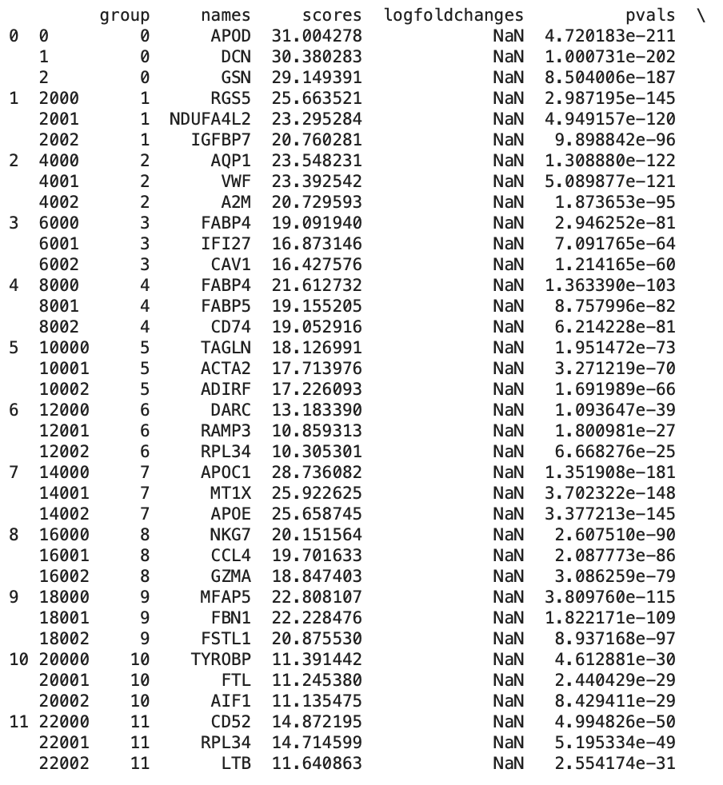
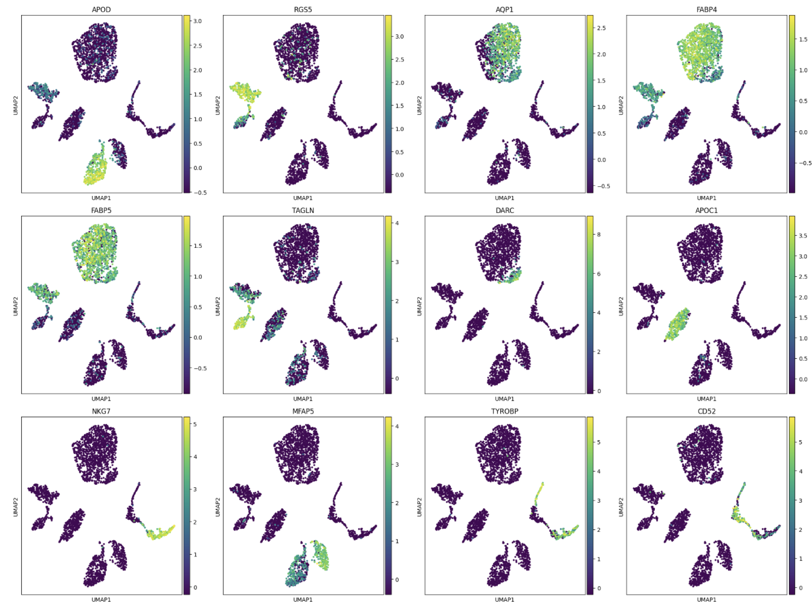
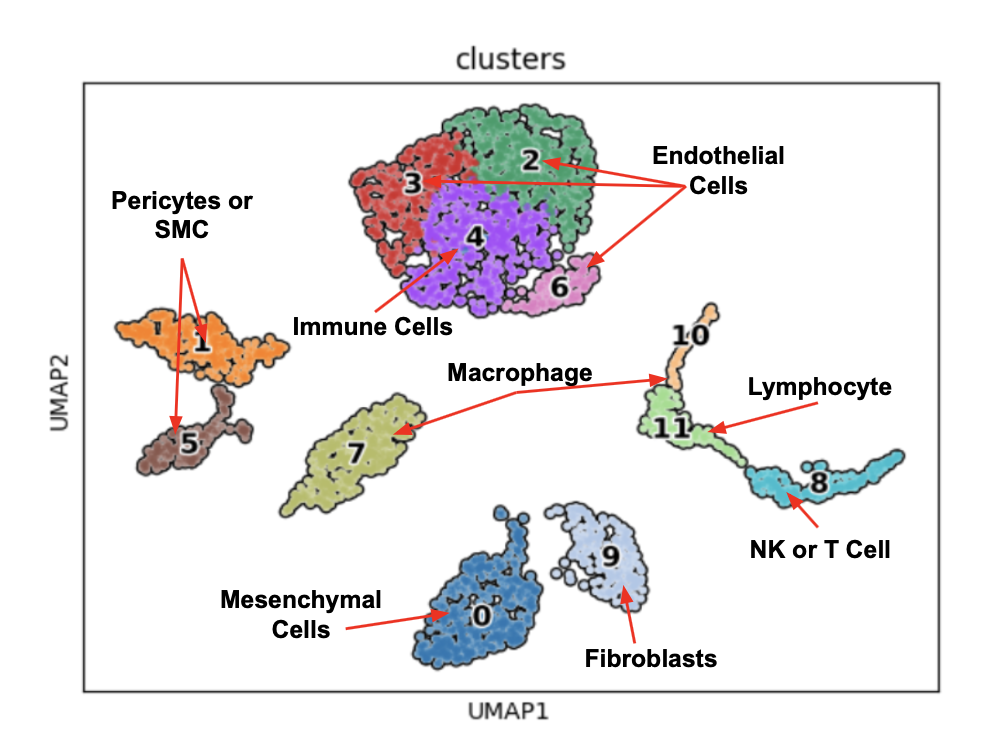
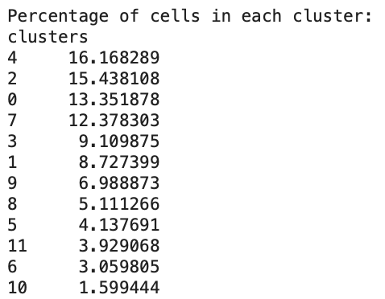

# 🧬 Project Introduction 

Skeletal muscle is a complex tissue made of various muscle fibers and cell types. In addition to its well-understood role in movement, skeletal muscle plays important roles in other processes such as immunity, metabolism, and brain function. 

To fully understand the importance of skeletal muscle in these functions, we must understand skeletal muscle's cellular composition, which is made possible through new sequencing techniques such as Single-cell RNA sequencing (scRNA-seq). Through scRNA-seq, we can identify specific cell types in a skeletal muscle sample using known and novel marker genes. We can then use that knowledge to better understand how specific stimuli, like exercise, alter gene expression on an individual cell level in specific cell types. 

In this project repository, I'll be exploring gene expression patterns in human skeletal muscle cells, specifically those taken from the vastus lateralis muscle (i.e., the outer quadriceps). This muscle is particularly significant as it is one of the largest and most powerful muscles in the body, and its is a prime mover during cyclic activities such as cycling, running, and rowing, as well as multi-joint compound exercises such as squatting. My goal is to identify the cellular composition of skeletal muscle using both well-known and novel marker genes. 

# 🧬 Project Walkthrough 
### Data Availability
The data for this project comes from a study called "Single-cell transcriptional profiles in human skeletal muscle," which is accessible via the Gene Expression Omnibus (GEO) via the following accession number: [GSE130646](https://www.ncbi.nlm.nih.gov/geo/query/acc.cgi). 

Additionally, we can access the Single-cell RNA sequencing data, resulting from each subject's muscle biopsy, using the following accession numbers: [GSM3746212](https://www.ncbi.nlm.nih.gov/geo/query/acc.cgi?acc=GSM3746212), [GSM3746213](https://www.ncbi.nlm.nih.gov/geo/query/acc.cgi?acc=GSM3746213), [GSM3746214](https://www.ncbi.nlm.nih.gov/geo/query/acc.cgi?acc=GSM3746214), and [GSM3746215](https://www.ncbi.nlm.nih.gov/geo/query/acc.cgi?acc=GSM3746215).

### Import Libraries 
Before loading the data above, I'll first import the following Python libraries, which will be used in downstream analyses:
```python
import pandas as pd
import scanpy as sc
import numpy as np
import anndata as an
import matplotlib.pyplot as plt
import seaborn as sns
from sklearn.metrics import silhouette_score
```

### Get Data, Decompress Files, and Create AnnData Object
Next, we'll use Bash's ```wget``` command to retrieve each subject's Single-cell RNA-seq data, and following that, we'll use the Bash ```gunzip``` command to decompress the files:
```bash
# retrieve subect data from GEO
!wget -O GSM3746212_Muscle_1_Counts.csv.gz 'https://www.ncbi.nlm.nih.gov/geo/download/?acc=GSM3746212&format=file&file=GSM3746212%5FMuscle%5F1%5FCounts%2Ecsv%2Egz'
!wget -O GSM3746213_Muscle_2_Counts.csv.gz 'https://www.ncbi.nlm.nih.gov/geo/download/?acc=GSM3746213&format=file&file=GSM3746213%5FMuscle%5F2%5FCounts%2Ecsv%2Egz'
!wget -O GSM3746214_Muscle_3_Counts.csv.gz 'https://www.ncbi.nlm.nih.gov/geo/download/?acc=GSM3746214&format=file&file=GSM3746214%5FMuscle%5F3%5FCounts%2Ecsv%2Egz'
!wget -O GSM3746215_Muscle_4_Counts.csv.gz 'https://www.ncbi.nlm.nih.gov/geo/download/?acc=GSM3746215&format=file&file=GSM3746215%5FMuscle%5F4%5FCounts%2Ecsv%2Egz'

# decompress files
!gunzip GSM3746212_Muscle_1_Counts.csv.gz
!gunzip GSM3746213_Muscle_2_Counts.csv.gz
!gunzip GSM3746214_Muscle_3_Counts.csv.gz
!gunzip GSM3746215_Muscle_4_Counts.csv.gz
```
Now that we've decompressed the CSV files, we'll read them using the Pandas ```read_csv()``` function. Following that, we'll convert each CSV file into an individual AnnData object before combining them into a single composite object named ```adata_combined```:
```python
# read and save subject data as CSV
file_1 = pd.read_csv('GSM3746212_Muscle_1_Counts.csv', index_col=0)
file_2 = pd.read_csv('GSM3746213_Muscle_2_Counts.csv', index_col=0)
file_3 = pd.read_csv('GSM3746214_Muscle_3_Counts.csv', index_col=0)
file_4 = pd.read_csv('GSM3746215_Muscle_4_Counts.csv', index_col=0)

# convert CSV files into standalone AnnData objects
muscle_1 = sc.AnnData(file_1)
muscle_2 = sc.AnnData(file_2)
muscle_3 = sc.AnnData(file_3)
muscle_4 = sc.AnnData(file_4)

# initialize list of AnnData objects, storing ea/ subjects data
adatas = [muscle_1, muscle_2, muscle_3, muscle_4]

# create composite AnnData object
adata_combined = sc.concat(adatas, axis=1, label='sample', keys=['muscle_1', 'muscle_2', 'muscle_3', 'muscle_4'])
adata_combined.var_names_make_unique()
```
We now have a composite AnnData object storing all of our subject's data. However, this composite object is formatted such that the rows are genes and the columns are cell IDs. As a result, we need to transpose our AnnData object so the rows are cell IDs and the columns are genes since this is the conventional format used for analyzing scRNA-seq data: 
```python
# transpose AnnData object 
adata_transposed = sc.AnnData(adata_combined.T)
```
Notably, I've saved the newly transposed AnnData object as ```adata_transposed```, and as a result, all downstream analysis will use this newly created AnnData object instead of our original variable, ```adata_combined```. Now, I'll print some basic summary information about our new AnnData object:
```python
num_genes = adata_transposed.n_vars # variables = columns (genes)
print(f"Number of Genes: {num_genes}")

num_cells = adata_transposed.n_obs # observations = rows (cells IDs)
print(f"Number of Cells: {num_cells}")
```
Which, produces the following output:
- Number of Genes: 15406
- Number of Cells: 2876

### Quality Control, Filtering, and Normalization 
Before analyzing our single-cell data, we'll need to perform quality control and inspect the integrity of our data. To start, we'll check if there are any missing values:
```python
# find indices of rows (cell IDs) with NaN values
nan_rows = np.isnan(adata_transposed.X).any(axis=1)
print(f"Number of rows with NaN values: {np.sum(nan_rows)}")

# find indices of columns (genes) with NaN values
nan_cols = np.isnan(adata_transposed.X).any(axis=0)
print(f"Number of columns with NaN values: {np.sum(nan_cols)}")
```
Which produces the following output:
- Number of rows with NaN values: 0
- Number of columns with NaN values: 0

As you can see, there are no missing values in the data set. Next, we'll look at the distribution of genes per cel, cells per gene, and percent mitochondrial content per cell to determine our filtering criteria:
```python
# calculate the number of genes expressed per cell
adata_transposed.obs['n_genes'] = (adata_transposed.X > 0).sum(axis=1)

# calculate the number of cells in which each gene is expressed
adata_transposed.var['n_cells'] = (adata_transposed.X > 0).sum(axis=0)

# identify mitochondrial genes 
mt_gene_mask = adata_transposed.var_names.str.startswith('MT-')

# calculate % mitochondrial genes per cell
if isinstance(adata_transposed.X, np.ndarray):
    adata_transposed.obs['percent_mito'] = np.sum(adata_transposed[:, mt_gene_mask].X, axis=1) / np.sum(adata_transposed.X, axis=1) * 100
else:
    adata_transposed.obs['percent_mito'] = np.sum(adata_transposed[:, mt_gene_mask].X.toarray(), axis=1) / np.sum(adata_transposed.X.toarray(), axis=1) * 100

# create subplots
fig, axes = plt.subplots(1, 3, figsize=(16, 5))

# plot histogram of the number of genes per cell
sns.histplot(adata_transposed.obs['n_genes'], bins=50, kde=True, ax=axes[0])
axes[0].set_xlabel('Number of Genes per Cell')
axes[0].set_ylabel('Number of Cells')
axes[0].set_title('Distribution of Number of Genes per Cell')

# plot histogram of the number of cells per gene
sns.histplot(adata_transposed.var['n_cells'], bins=50, kde=True, ax=axes[1])
axes[1].set_xlabel('Number of Cells per Gene')
axes[1].set_ylabel('Number of Genes')
axes[1].set_title('Distribution of Number of Cells per Gene')

# plot the distribution of mito gene %
sns.histplot(adata_transposed.obs['percent_mito'], bins=50, kde=True, ax=axes[2])
axes[2].set_xlabel('Percentage of Mitochondrial Genes')
axes[2].set_ylabel('Number of Cells')
axes[2].set_title('Distribution of Mitochondrial Gene % per Cell')

plt.tight_layout()
plt.show()
```
Which produces the following output:


Based on the output above, it's clear that some filtering was already applied to this data before it was stored in the Gene Expression Omnibus (GEO). For example, there aren't any cells in the dataset with a mitochondrial gene percentage over ~5% (generally, we want to filter out cells with a mitochondrial gene percentage of >10% or >15%).

However, before moving on, I'll do some basic filtering, removing cells with fewer than 200 detected genes and genes that appear in fewer than 20 cells (I do not expect genes appearing in fewer than 20 cells to exist in this dataset based on the visualization above, but It's worth hedging our bets in case they were washed out of the visualization due to too few counts). 
```python
# filter out cells that have fewer than 200 detected genes
sc.pp.filter_cells(adata_transposed, min_genes=200)

# filter out genes that appear in fewer than 20 cells
sc.pp.filter_genes(adata_transposed, min_cells=20) 

# print resulting number of cells and genes
num_genes = adata_transposed.n_vars
print(f"Number of Genes: {num_genes}")

num_cells = adata_transposed.n_obs
print(f"Number of cells: {num_cells}")
```
Which produces the following output:
- Number of Genes: 10485
- Number of cells: 2876

As you can see in the output above, filtering our cells with fewer than 200 detected genes removed 4921 genes from the dataset, a 30% reduction in the number of genes present. However, our filtering criteria did not remove any cells from the dataset. 

Following filtering, I'll apply global-scaling normalization, which consists of dividing each gene's expression level by the total expression in that cell, multiplying the result by a scaling factor to standardize the values, and then applying a log transformation to stabilize the variance. Then, following that, I'll identify the 2000 most highly variable genes in our dataset, which are useful for distinguishing different cell types or states, and remove all other genes from the AnnData object:
```python
# apply global-scaling normalization
sc.pp.normalize_total(adata_transposed, target_sum=1e4)
sc.pp.log1p(adata_transposed)

# find the 2000 most highly variable genes 
sc.pp.highly_variable_genes(adata_transposed, n_top_genes=2000, subset=True)
print(adata_transposed)
```
Which produces the following output:
- AnnData object with n_obs × n_vars = 2187 × 2000

As you can see in the output above, our AnnData object now contains 2187 cells and 2000 genes that exhibit the highest variability between cells. 

### Dimensionality Reduction
As demonstrated above, single-cell RNA sequencing data is high-dimensional, consisting of thousands of genes measured across thousands of cells. High-dimensional data is challenging to analyze and interpret, so dimensionality reduction techniques are used to simplify the data by reducing the number of dimensions while simultaneously retaining the most important information in the dataset. 

In the code block below, I'll apply a dimensionality reduction technique called principal component analysis (PCA), which reduces the dimensionality of the data while capturing most of the variance. However, before doing so, I'll use z-transformation, which standardizes the data so that each gene has a mean of zero and a standard deviation of one. This reduces the influence of genes with extremely high expression levels and ensures that all genes contribute equally to downstream analyses. 
```python
# apply z-transformation
sc.pp.scale(adata_transposed, zero_center=True)

# perform dimensionality reduction via PCA
sc.tl.pca(adata_transposed, svd_solver='arpack')
```
After reducing the dimensionality of our data, I'll construct a graph of nearest neighbors, which identifies the 10 most similar neighbors (specified by the code ```n_neighbors=10```) for each cell in a simplified dataset, with ten principal components  (```n_pcs=10```), based on their gene expression profiles. 

I'll then use Leiden clustering to group cells into clusters based on their gene expression profiles. Cells in the same cluster are more similar to one another than they are to cells in other clusters, and the Leiden algorithm's resolution parameter controls the size and number of included clusters. 

Finally, I'll use a UMAP plot to visualize the color-coded clusters composed of similar cells. 
```python
# construct graph of nearest neighbors 
sc.pp.neighbors(adata_transposed, n_neighbors=10, n_pcs=10)

# apply leiden clustering algorithm 
sc.tl.leiden(adata_transposed, key_added='clusters', resolution=0.5, n_iterations=3, flavor='igraph', directed=False)

# create and visualize UMAP 
sc.tl.umap(adata_transposed)
sc.pl.umap(adata_transposed, color='clusters', add_outline=True, legend_loc='on data', legend_fontsize=12, legend_fontoutline=2, frameon=True)
```
Which produces the following output:


As you can see in the image above, our cells grouped into 12 clusters based on shared characteristics. We can then use silhouette score to assess the quality of our clusters, as demonstrated below:
```python
labels = adata_transposed.obs['clusters']
sil_score = silhouette_score(adata_transposed.obsm['X_pca'], labels)
print(f'Silhouette Score: {sil_score}')
```
Which produces the following output:
- Silhouette Score: 0.15771949291229248

Ordinarily, a silhouette score of ~0.16 is considered low and indicates weak clustering. However, it's important to understand its context within the homogeneity of the tissue being studied. Muscle biopsy samples are inherently composed of a limited variety of cell types, often resulting in less distinct clusters compared to more heterogeneous tissues like blood, where we expect silhouette scores to be much higher (0.7-1.0). This homogeneity can lead to lower silhouette scores because the differences between clusters are subtler.

In these cases, the silhouette score is not the sole indicator of clustering quality. Instead, we should focus on optimizing clustering parameters for the specific dataset, aiming to locally maximize the silhouette score, ensuring that the clusters identified are meaningful and biologically relevant (note - I had to adjust the ```n_neighbors```, ```n_pcs```, and ```resolution``` parameters multiples times to increase this score from ~0.10 to ~0.16). The objective should be to refine the analysis to capture the subtle distinctions that exist within the homogeneous tissue rather than aiming for a high silhouette score in absolute terms. This approach ensures that the clustering is tailored to the specific characteristics of the muscle biopsy data, providing valuable insights despite the lower silhouette score.

### Identifying Marker Genes and Cell Composition of Tissues
Now that we've filtered, normalized, and transformed our data, reduced its dimensionality, and identified clusters of similar cells, we'll perform a differential expression analysis to determine the top marker genes in each cluster. 

First, we'll find genes that are particularly important or different in each of the clusters of cells we've identified using a statistical test called the Wilcoxon rank-sum test to find these differences. Then, we'll adjust the results to account for multiple comparisons using Bonferroni correction to reduce the chances of false positives. Following that, we'll store the results from the first step in a list variable named ```top_markers```before converting that variable into a data frame. 
```python
# identify marker genes
sc.tl.rank_genes_groups(adata_transposed, groupby='clusters', method='wilcoxon', corr_method='bonferroni')

# store marker genes in list and convert list to data frame
top_markers = sc.get.rank_genes_groups_df(adata_transposed, group=None)
top_markers_df = pd.DataFrame(top_markers)
```
Following that, we'll initialize a dictionary named ```top_genes_per_cluster``` to store the top marker genes for each cluster, and then we'll save a list of our clusters in a variable named ```clusters```. We'll then use a ```for loop``` to go through each cluster and find the top 3 marker genes, which will be stored in the dictionary above before converting said dictionary into a summary table for ease of viewing.
```python
# initialize a dictionary to store top markers for each cluster
top_genes_per_cluster = {}

# store list of clusters
clusters = adata_transposed.uns['rank_genes_groups']['names'].dtype.names

# iterate over each cluster to get top markers and store them in top_genes_per_cluster dictioary 
for cluster in clusters:
    top_genes = top_markers_df[top_markers_df['group'] == cluster].head(3)
    top_genes_per_cluster[cluster] = top_genes

# convert dictionary to data frame
top_genes_summary = pd.concat(top_genes_per_cluster.values(), keys=top_genes_per_cluster.keys())
print(top_genes_summary)
```
Which produces the following output:



The image above depicts the top three marker genes in each of our twelve clusters. I'll now create a list, using the single most expressed marker gene for each cluster.
```python
marker_genes = ['APOD', 'RGS5', 'AQP1', 'FABP4', 'FABP5', 'TAGLN', 'DARC', 'APOC1', 'NKG7', 'MFAP5', 'TYROBP', 'CD52']
```
Now, I'll create a UMAP for each marker gene to visualize the degree to which it's expressed in each cluster. 
```python
# plot UMAP for each marker gene
fig, axes = plt.subplots(nrows=3, ncols=4, figsize=(20, 15))
axes = axes.flatten()
for i, gene in enumerate(marker_genes):
    if gene in adata_transposed.var_names:
        sc.pl.umap(adata_transposed, color=gene, ax=axes[i], title=gene, show=False)
    else:
        axes[i].set_title(f"{gene} not in dataset")
        axes[i].axis('off')
plt.tight_layout()
plt.show()
```
Which produces the following output:



As you can see in the image below, each marker gene is highly expressed in a single cluster or a small subset of clusters. Some of these marker genes are previously known, such as NKG7, a marker gene for natural killer (NK) cells, or AQP1, a marker gene for endothelial cells, while others are not commonly associated with specific cell types.

By using a combination of the known marker genes above and their distribution across clusters, other known marker genes in our ```top_genes_summary``` data frame, and a literature search of our novel marker genes, we can decode the identity of each cluster in our UMAP plot and dataset, as described in the next section. 

### Decoding The Cellular Composition of Skeletal Muscle
To determine the cellular identity of each cluster, I will look at the known functions and expression patterns of the top marker genes for each cluster. This analysis involves understanding which cell types typically express these genes, and their roles in the tissue context of skeletal muscle, as demonstrated below:

- **Cluster 0:** The three most highly expressed marker genes are APOD, DCN, and GSN. DCN and GSN are known marker genes for mesenchymal cells, and as a result we can say with 
high confidence that cluster 0 represents **mesenchymal cells**.
- **Cluster 1:** The three most highly expressed genes in cluster 1 are RGS5, commonly expressed in pericytes and smooth muscle cells; NDUFA4L2, which is expressed in cells with high metabolic activity; and IGFBP7, which is involved in cell growth and commonly expressed in endothelial cells and some smooth muscle cells. Based on these criteria, we can say with moderate confidence that cluster 1 represents **pericytes** or **smooth muscle cells**.
- **Cluster 2:** The three most highly expressed genes are AQP1, a water channel protein highly expressed in endothelial cells; VWF, a known marker gene for endothelial cells; and A2M, which is commonly associated with blood plasma. Based on these criteria, we can say with fairly high confidence that cluster 2 represents **endothelial cells**. 
- **Cluster 3:** the three most highly expressed genes are FABP4, which is involved in lipid metabolism, and is commonly found in endothelial cells; IFI27, a non cell-type specific marker; and CAV1, which is commonly found in adipocytes and endothelial cells. Thus, we can say with medium to high certainty that cluster 3 represents **endothelial cells**.
- **Cluster 4:** FABP4 is also highly expressed in cluster 4, as is FABP5, which is also involved in lipid metabolism and is commonly found in immune cells, and CD74, which is highly expressed in antigen-presenting cells. Thus, we can say with medium confidence that cluster 4 represents **immune cells** (non-specific). 
  **Cluster 5:** the three most highly expressed marker genes are TAGLN, a known marker for smooth muscle cells; ACTA2, another a known marker for smooth muscle cells; and ADIRF, which is incolved in adipogenesis. As a result, we can say that cluster 5 represents **smooth muscle cells** with high confidence.
- **Cluster 6:** the three most highly expressed genes are DARC, which is expressed in endothelial and some red blood cells and RAMP3 and RPL34, which are non cell-type specific genes expressed in a wide variety of cells. Thus, it's plausible that cluster 6 represents **endothelial cells**, but we should not have a high degree of condidence in this prediction.
- **Cluster 7:** the three most highly expressed genes are APOC1, which is involved in lipid metabolism and highly expressed in liver cells and macrophages; MT1X, which is expresed in various tissues, including immune cells; and APOE, which is involved in lipid transport and metabolism and is expressed in liver cells and macrophages. As a result, we can say with medium confidence that cluster 7 represents **macrophages**.
- **Cluster 8:** this cluster has high expression of NKG7, a known marger for natural killer cells and cytotoxic T cells; CCL2, which is involved in theimmune response; and GZMA, which is an enzyme found in both NK and T cells. Thus, we can say with high confidence that this cluster represents **NK cells** or **T cells**.
- **Cluster 9:** MFAP5, FBN1, and FSTL1, which are known marker genes for fibroblasts, are all highly expressed in this cluster, and as a result we can say with high confidence that cluster 9 represents **fibroblasts**.
- **Cluster 10:** In this cluster TYROPB, FTL, and AIF1 are all highly expressed. All three of these genes are commonly associated with macrophrages, and other immune cells, and as a result we can say with moderate to high confidene that cluster 10 represents **macrophages.**
- **Cluster 11:** The three most highly expressed genes in this cluster are CD52, which is expressed in immune cels, particulaly lymphocytes; RPL34, which is a ribsomal protein found in nearly all cell types; and LTB, which is involved in the immune response. Thus, we can say with moderate to high confidene that cluster 11 represents **lymphocytes**.

Based on the information above, we can tentativley conclude that our vastus lateralis muscle biopsies were composed of mesenchymal cells (cluster 0), pericytes or smooth muscle cells (cluster 1 and 5), endothelial cells (cluster 2, 3, 6), immune cells (cluster 4), macrophages (cluster 7 and 10), NK or T cells (cluster 8), fibroblasts (cluster 9), and lymphocytes (cluster 11), as depicted below:



Now that we've identified the potential cellular identity of each cluster, I want to better understand the relative contribution of each cell type in our skeletal muscle samples, which I'll calculate with the following code:
```python
# get the counts of cells in each cluster
cluster_counts = adata_transposed.obs['clusters'].value_counts()

# calculate the total number of cells
total_cells = len(adata_transposed.obs)

# calculate the percentage of cells in each cluster
cluster_percentages = (cluster_counts / total_cells) * 100

# display the results
print("\nPercentage of cells in each cluster:")
print(cluster_percentages)
```
Which, produces the following results:



After combining clusters with a shared identity, we get the following breakdown: endothelial cells (27.6%), immune cells (16.2%), mesenchymal cells (13.4%), macrophages (13.9%), pericytes or smooth muscle cells (12.9%), fibroblasts (6.7%), and lymphocytes (3.9%)

Notably, the distribution of cell types above is relatively consistent with the expected cellular composition of skeletal muscle tissue. However, there are some minor abnormalities. For example, macrophages and immune cells, in general, make up a higher-than-expected percentage of the sample's cellular composition. However, this can plausibly be attributed to ongoing inflammation or repair in the tissue, as is common following an intense exercise stimulus.

To validate our findings further, we'll need to compare them with other skeletal muscle single-cell studies to see if similar cell-type proportions are reported. For example, in a study titled [Single-cell sequencing deconvolutes cellular responses to exercise in human skeletal muscle](https://www.nature.com/articles/s42003-022-04088-z), the investigators found that endothelial cells were the most abundant cell type in skeletal muscle, making up 44% of the samples on average and as low as 30% in some individuals. Thus, our value of 27.6% falls within a plausible range of human variation. Additionally, our values for mesenchymal cells, pericytes, and lymphocytes fall within the range of values found in the study above as well. 

While the current studies reporting cell type composition in human skeletal muscle are limited by small sample sizes (generally n<10), it's important not to over interpret the data. However, with the potential for a larger dataset over time, we can define normal cell type compositions in specific muscles and for different demographics (age, sex, body composition, fitness level), enhacing our understanding of skeletal muscle biology and its adaptation to exercise and other stimuli. 
