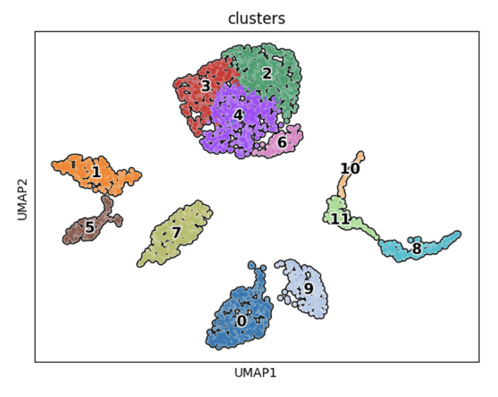

# 🧬 Project Introduction 

Skeletal muscle is a diverse and complex tissue made up of various muscle fibers and other cell types. Besides its well-known role in movement, muscle tissue also affects other important processes like immunity, metabolism, and brain function. To fully understand these effects, we need to look closely at the different types of cells in skeletal muscle, which is made possible with single-cell RNA sequencing. 

In this project repo, we’ll explore the gene expression patterns in human skeletal muscle cells by analyzing single-cell RNA sequencing data from the vastus lateralis muscle of four different people. Our goal is to figure out what kinds of cells are present in the muscle and identify them using both well-known and new marker genes.

The data for this project comes from a study called "Single-cell transcriptional profiles in human skeletal muscle" (GEO accession number [GSE130646](https://www.ncbi.nlm.nih.gov/geo/query/acc.cgi). For each of the four subjects, the single-cell RNA sequencing data can be accessed using the following GEO accession numbers: [GSM3746212](https://www.ncbi.nlm.nih.gov/geo/query/acc.cgi?acc=GSM3746212), [GSM3746213](https://www.ncbi.nlm.nih.gov/geo/query/acc.cgi?acc=GSM3746213), [GSM3746214](https://www.ncbi.nlm.nih.gov/geo/query/acc.cgi?acc=GSM3746214), and [GSM3746215](https://www.ncbi.nlm.nih.gov/geo/query/acc.cgi?acc=GSM3746215).

# 🧬 Project Walkthrough 
### Import Libraries 
Before starting this project you'll need to import the following libraries in Python:
```
import pandas as pd
import scanpy as sc
import numpy as np
import anndata as an
import matplotlib.pyplot as plt
import seaborn as sns
from sklearn.metrics import silhouette_score
```
### Get Data, Decompress Files, and Create AnnData Object
First, we need to use Bash's ```wget``` command to retrieve the sc-RNA-Seq data associated with each subejcts muscle sample, then we'll use the ```gunzip``` command to decompress the files:
```
!wget -O GSM3746212_Muscle_1_Counts.csv.gz 'https://www.ncbi.nlm.nih.gov/geo/download/?acc=GSM3746212&format=file&file=GSM3746212%5FMuscle%5F1%5FCounts%2Ecsv%2Egz'
!gunzip GSM3746212_Muscle_1_Counts.csv.gz

!wget -O GSM3746213_Muscle_2_Counts.csv.gz 'https://www.ncbi.nlm.nih.gov/geo/download/?acc=GSM3746213&format=file&file=GSM3746213%5FMuscle%5F2%5FCounts%2Ecsv%2Egz'
!gunzip GSM3746213_Muscle_2_Counts.csv.gz

!wget -O GSM3746214_Muscle_3_Counts.csv.gz 'https://www.ncbi.nlm.nih.gov/geo/download/?acc=GSM3746214&format=file&file=GSM3746214%5FMuscle%5F3%5FCounts%2Ecsv%2Egz'
!gunzip GSM3746214_Muscle_3_Counts.csv.gz

!wget -O GSM3746215_Muscle_4_Counts.csv.gz 'https://www.ncbi.nlm.nih.gov/geo/download/?acc=GSM3746215&format=file&file=GSM3746215%5FMuscle%5F4%5FCounts%2Ecsv%2Egz'
!gunzip GSM3746215_Muscle_4_Counts.csv.gz
```
Following that, we'll read the decompressed muscle counts csv files with Panda's ```read_csv()``` function, then we'll convert the individual CSV files into Anndata objects before combining them into a single AnnData object:
```
file_1 = pd.read_csv('GSM3746212_Muscle_1_Counts.csv', index_col=0)  
muscle_1 = sc.AnnData(file_1)

file_2 = pd.read_csv('GSM3746213_Muscle_2_Counts.csv', index_col=0)  
muscle_2 = sc.AnnData(file_2)

file_3 = pd.read_csv('GSM3746214_Muscle_3_Counts.csv', index_col=0) 
muscle_3 = sc.AnnData(file_3)

file_4 = pd.read_csv('GSM3746215_Muscle_4_Counts.csv', index_col=0)  
muscle_4 = sc.AnnData(file_4)

# store all hour anndata objects in a list, then combine all 4 anndata objects into a single anndata object 
adatas = [muscle_1, muscle_2, muscle_3, muscle_4]
adata_combined = sc.concat(adatas, axis=1, label='sample', keys=['muscle_1', 'muscle_2', 'muscle_3', 'muscle_4'])
adata_combined.var_names_make_unique()
```
Next, we'll transpose our AnnData object so the rows are cell ID's and the columns are genes (since this is assumed for many down stream analysis):
```
adata_transposed = sc.AnnData(adata_combined.T)
```
Then, we'll print some basic summary information for our AnnData object:
```
num_genes = adata_transposed.n_vars
print(f"Number of Genes: {num_genes}")

num_cells = adata_transposed.n_obs
print(f"Number of Cells: {num_cells}")
```
Following the code block above we'll see the following output:
- Number of Genes: 15406
- Number of Cells: 2876

### Quality Control, Filtering, and Normalization 

To start, we'll check if there's any missing data in our combined AnnData object:
```
# Find indices of rows (cells) with NaN values
nan_rows = np.isnan(adata_transposed.X).any(axis=1)
print(f"Number of rows with NaN values: {np.sum(nan_rows)}")

# Find indices of columns (genes) with NaN values
nan_cols = np.isnan(adata_transposed.X).any(axis=0)
print(f"Number of columns with NaN values: {np.sum(nan_cols)}")
```
Which produces the following output:
- Number of rows with NaN values: 0
- Number of columns with NaN values: 0

Luckily, there are no missing values. Next, we'll look at the distribution of genes per cell, cells per gene, and percent mitochondrial content per cell to determine our filtering criteria:
```
# Calculate the number of genes per cell and cells per gene
adata_transposed.obs['n_genes'] = (adata_transposed.X > 0).sum(axis=1)
adata_transposed.var['n_cells'] = (adata_transposed.X > 0).sum(axis=0)

# Identify mitochondrial genes and calculate % of mitochondrial genes per cell
mt_gene_mask = adata_transposed.var_names.str.startswith('MT-')

if isinstance(adata_transposed.X, np.ndarray):
    adata_transposed.obs['percent_mito'] = np.sum(adata_transposed[:, mt_gene_mask].X, axis=1) / np.sum(adata_transposed.X, axis=1) * 100
else:
    adata_transposed.obs['percent_mito'] = np.sum(adata_transposed[:, mt_gene_mask].X.toarray(), axis=1) / np.sum(adata_transposed.X.toarray(), axis=1) * 100

# Create subplots
fig, axes = plt.subplots(1, 3, figsize=(16, 5))

# Plot the histogram of the number of genes per cell
sns.histplot(adata_transposed.obs['n_genes'], bins=50, kde=True, ax=axes[0])
axes[0].set_xlabel('Number of Genes per Cell')
axes[0].set_ylabel('Number of Cells')
axes[0].set_title('Distribution of Number of Genes per Cell')

# Plot the histogram of the number of cells per gene
sns.histplot(adata_transposed.var['n_cells'], bins=50, kde=True, ax=axes[1])
axes[1].set_xlabel('Number of Cells per Gene')
axes[1].set_ylabel('Number of Genes')
axes[1].set_title('Distribution of Number of Cells per Gene')

# Plot the distribution of mitochondrial gene percentage
sns.histplot(adata_transposed.obs['percent_mito'], bins=50, kde=True, ax=axes[2])
axes[2].set_xlabel('Percentage of Mitochondrial Genes')
axes[2].set_ylabel('Number of Cells')
axes[2].set_title('Distribution of Mitochondrial Gene % per Cell')

plt.tight_layout()
plt.show()
```
Which produces the following output:


Based on the data in the image above, I'll filter out cells that have fewer than 200 detected genes and genes that appear in less than 20 cells. However, there is no need to filter cells based on percent mitochondrial content. Thus, I can quickly perform filtering with the following code:
```
# filter
sc.pp.filter_cells(adata_transposed, min_genes=200) #This filters out cells that have fewer than 200 detected genes
sc.pp.filter_genes(adata_transposed, min_cells=20) #This filters out genes that appear in fewer than 20 cells.

# print resulting number of cells and genes
num_genes = adata_transposed.n_vars
print(f"Number of Genes: {num_genes}")

num_cells = adata_transposed.n_obs
print(f"Number of cells: {num_cells}")
```
Which produces the following output:
- Number of Genes: 10485
- Number of cells: 2876

Following that, I used a global-scaling normalization, which consists of dividing each gene’s expression level by the total expression in that cell, multiplying the result by a scaling factor to standardize the values, and then applying a log transformation to stabilize the variance. Then, after that that, I identified 2000 high variables genes that showed significant variability across different cells, which are likely important for distinguishing different cell types or states. 
```
# normalize
sc.pp.normalize_total(adata_transposed, target_sum=1e4)
sc.pp.log1p(adata_transposed)

# find the 2000 most highly variable genes
sc.pp.highly_variable_genes(adata_transposed, n_top_genes=2000, subset=True)

print(adata_transposed)
```
Which produces the following output:
- AnnData object with n_obs × n_vars = 2187 × 2000
Indicating that our Anndata objet now contains 2187 cells with the 2000 most highly variable genes

### Dimensionality Reduction

Now, single-cell RNA sequencing data consists of thousands of genes measured across thousands of cells, meaning the data is 'high dimensional'. This high-dimensional data can be challenging to analyze and interpret, so dimensionality reduction techniques are used to simplify the data by reducing the number of dimensions while retaining the most important information.

Before performing dimensionality reduction, I used z-transformation on my gene expression data. Z-transformation works by standardizing the data so that each gene has a mean of zero and a standard deviation of one, thus reducing the influence of genes with extremely high expression levels and ensuring that all genes contribute equally to the analysis. In the code block below, I'll show you how to perform Z-transformation:
```
# z-transformation
sc.pp.scale(adata_transposed, zero_center=True)
```
Following Z-transformation, the I used principal component analysis to reduce the dimensionality in the data, while capturing the most variance, as demonstrated below:
```
# Perform PCA: Reduce dimensionality to capture the most variance in the data.
sc.tl.pca(adata_transposed, svd_solver='arpack')
```
Following that, I performed clustering with the following code:
```
# Compute Neighbors and Clusters: Determine the nearest neighbors and cluster the cells.
sc.pp.neighbors(adata_transposed, n_neighbors=10, n_pcs=10)
sc.tl.leiden(adata_transposed, key_added='clusters', resolution=0.5, n_iterations=3, flavor='igraph', directed=False)

# visualize clusters
sc.tl.umap(adata_transposed)
sc.pl.umap(adata_transposed, color='clusters', add_outline=True, legend_loc='on data', legend_fontsize=12, legend_fontoutline=2, frameon=True)
```
Which produces the following output:



Finally, before moving on I used a silohoutte score to assess the quality of my clutering, as demonstrated below:
```
# calculate silohoutte score
labels = adata_transposed.obs['clusters']
sil_score = silhouette_score(adata_transposed.obsm['X_pca'], labels)
print(f'Silhouette Score: {sil_score}')
```
Which produces the following output:
- Silhouette Score: 0.15771949291229248
- 
Generally, a score of 0.15 would indicate weak clustering and that we should adjust parameters in our clustering algorithm to achieve a higher score. However, in cases wehre all of the cells in our sample come from a single tissue (i.e., skeletal muscle) it's common for Silhouette scores to be on the low end. As a result, I've adjsuted the parameters to the best of my ability to increase the silohutte score, knowing that the homogeneity of the tissue will prevent me from maximizing it and achieving gold standard values of 0.7-1.0


### Identifying Marker Genes and Cell Composition of Tissues
Next, we'll perform differential expression analysis to identify top marker genes in each of our clusters:
```
# Perform Differential Expression Analysis: Use differential expression testing to find genes that are differentially expressed between clusters.
sc.tl.rank_genes_groups(adata_transposed, groupby='clusters', method='wilcoxon', corr_method='bonferroni')

# find top marker genes for each cluster.
top_markers = sc.get.rank_genes_groups_df(adata_transposed, group=None)

# now, we're going to convert top_markers to DF to get summary of top markers per cluster
# Convert to DataFrame
top_markers_df = pd.DataFrame(top_markers)

# Initialize a dictionary to store top markers
top_genes_per_cluster = {}

# Get list of clusters
clusters = adata_transposed.uns['rank_genes_groups']['names'].dtype.names

# Iterate over each cluster to get top markers
for cluster in clusters:
    # Get top 3 genes for the current cluster
    top_genes = top_markers_df[top_markers_df['group'] == cluster].head(3)
    top_genes_per_cluster[cluster] = top_genes

# Convert dictionary to DataFrame for easy viewing
top_genes_summary = pd.concat(top_genes_per_cluster.values(), keys=top_genes_per_cluster.keys())
print(top_genes_summary)

```
Which produces the following output:


The image above depicts the top three marker genes expressed in each of our cluster. Now, we'll take the top marker gene for each cluster and then visualize it's expression across all clusters to observe it's distribution:
```
marker_genes = ['APOD', 'RGS5', 'AQP1', 'FABP4', 'FABP5', 'TAGLN', 'DARC', 'APOC1', 'NKG7', 'MFAP5', 'TYROBP', 'CD52']

# Plot UMAP for each marker gene
fig, axes = plt.subplots(nrows=3, ncols=4, figsize=(20, 15))
axes = axes.flatten()

for i, gene in enumerate(marker_genes):
    if gene in adata_transposed.var_names:
        sc.pl.umap(adata_transposed, color=gene, ax=axes[i], title=gene, show=False)
    else:
        axes[i].set_title(f"{gene} not in dataset")
        axes[i].axis('off')

plt.tight_layout()
plt.show()
```
Which produces the following output:


In the image above we can see how cluster specific marker genes are differentially expressed between clusters. 

Now, by using a combination of known cell-specific marker genes, and literature searches, we can decode each clusters cell type identify as follows:
